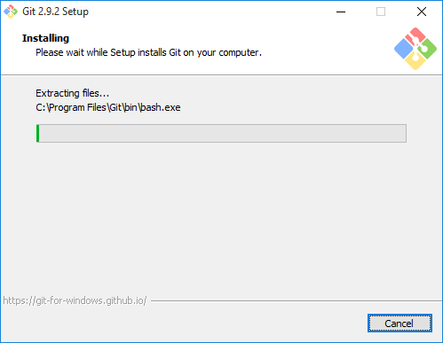
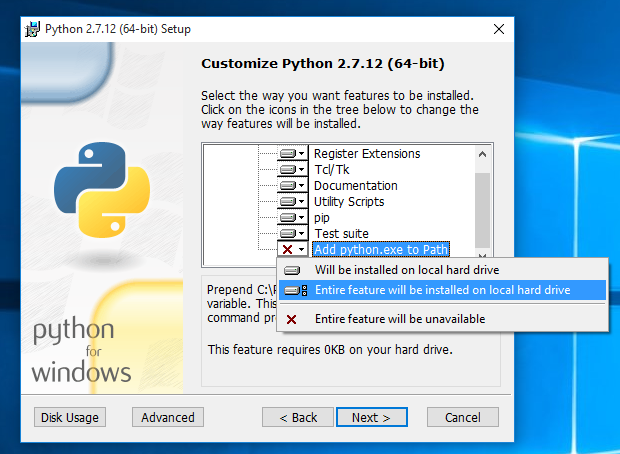
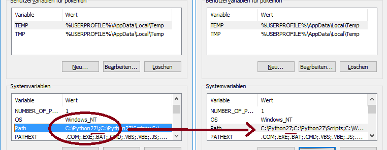
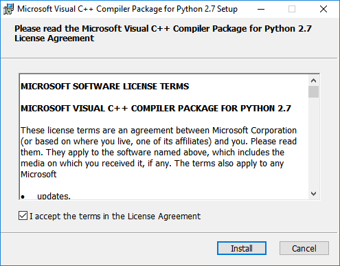

# Windows Prerequisites

In order to run the project, you will need Python, pip and the project dependencies.

## Prerequisites

  - [git for windows](https://git-for-windows.github.io/)
  - [Python 2.7.1.2](https://www.python.org/downloads/release/python-2712/)
  - [Microsoft Visual C++ Compiler for Python 2.7](https://www.microsoft.com/en-us/download/details.aspx?id=44266)

## Step 1: Install Git for Windows

Download Git for Windows from the link above and install it. You will be fine with all recommended options during the setup.

## Step 2: Install Python

**Note**: If you already have another version of Python installed, you probably want to uninstall that version and install 2.7.1.2. I did not test this setup with any other version.

Download Python 2.7.1.2 either as the 64bit or the 32bit version from the link above. **Make sure** to add Python to PATH during the setup (see screenshot)!

> You may run into issues running python if you do not install it onto your primary partition (typically `c:`)

## Optional: Fix Python Path

> This step is not needed on every system, but it's probably good to check if everything is set up correctly.

First things first. Press `WindowsKey + PAUSE` on your keyboard and select *Advanced System Settings* from the left side menu. At the bottom of that windows click *Environment Variables*. In my case the Python value for the Path variable was set to `C:\Python27\;` which is wrong. You have to remove final backslash if that's the case for you too. If you're having issues with this feel free to open an Issue.

All set, head back to the basic install guide.

## Step 2: Install C++ Compiler for Python

Download the Visual C++ Compiler for Python from the link above and install it. There is no changes required other than accepting the terms.

